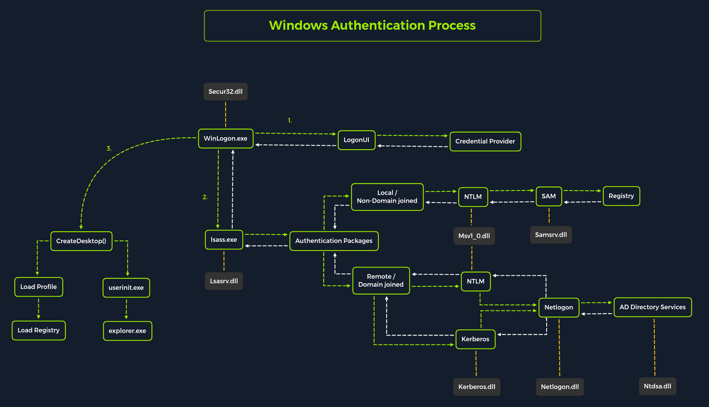

# Sistemas Operativos

## Windows

### Autenticación Windows

<table><thead><tr><th width="176.77777099609375"></th><th></th></tr></thead><tbody><tr><td><code>Lsasrv.dll</code></td><td>El servicio del servidor LSA implementa las políticas de seguridad y actúa como administrador de paquetes de seguridad para el LSA. El LSA contiene la función Negociar, que selecciona el protocolo NTLM o Kerberos tras determinar cuál es el protocolo adecuado.</td></tr><tr><td><code>Msv1_0.dll</code></td><td>Paquete de autenticación para inicios de sesión en máquinas locales que no requieren autenticación personalizada.</td></tr><tr><td><code>Samsrv.dll</code></td><td>El Administrador de cuentas de seguridad (SAM) almacena cuentas de seguridad locales, aplica políticas almacenadas localmente y admite API.</td></tr><tr><td><code>Kerberos.dll</code></td><td>Paquete de seguridad cargado por LSA para la autenticación basada en Kerberos en una máquina.</td></tr><tr><td><code>Netlogon.dll</code></td><td>Servicio de inicio de sesión basado en red.</td></tr><tr><td><code>Ntdsa.dll</code></td><td>Esta biblioteca se utiliza para crear nuevos registros y carpetas en el registro de Windows.</td></tr></tbody></table>

<figure><figcaption></figcaption></figure>

Almacenamiento de credenciales

<table><thead><tr><th width="151.2742919921875"></th><th></th></tr></thead><tbody><tr><td><code>HKLM\SAM</code></td><td>Contiene hashes de contraseñas de cuentas de usuario locales. Estos hashes se pueden extraer y descifrar para revelar contraseñas en texto plano.</td></tr><tr><td><code>HKLM\SYSTEM</code></td><td>Almacena la clave de arranque del sistema, que se utiliza para cifrar la base de datos SAM. Esta clave es necesaria para descifrar los hashes.</td></tr><tr><td><code>HKLM\SECURITY</code></td><td>Contiene información confidencial utilizada por la Autoridad de Seguridad Local (LSA), incluidas credenciales de dominio almacenadas en caché (DCC2), contraseñas de texto sin formato, claves DPAPI y más.</td></tr></tbody></table>

## Linux

### Passwd

```bash
htb-student:x:1000:1000:,,,:/home/htb-student:/bin/bash
```

| Compo                                              | Valor               |
| -------------------------------------------------- | ------------------- |
| Nombre de usuario                                  | `htb-student`       |
| Contraseña                                         | `x`                 |
| ID de usuario                                      | `1000`              |
| Identificación del grupo                           | `1000`              |
| [GECOS](https://en.wikipedia.org/wiki/Gecos_field) | `,,,`               |
| Directorio de inicio                               | `/home/htb-student` |
| Shell predeterminado                               | `/bin/bash`         |

### Shadow

```bash
htb-student:$y$j9T$3QSBB6CbHEu...SNIP...f8Ms:18955:0:99999:7:::
```

| Campo                  | Valor                              |
| ---------------------- | ---------------------------------- |
| Nombre de usuario      | `htb-student`                      |
| Contraseña             | `$y$j9T$3QSBB6CbHEu...SNIP...f8Ms` |
| Último cambio          | `18955`                            |
| Edad mínima            | `0`                                |
| Edad máxima            | `99999`                            |
| Período de advertencia | `7`                                |
| Periodo de inactividad | `-`                                |
| Fecha de expiración    | `-`                                |
| Campo reservado        | `-`                                |

Desglose del hash

```bash
$<id>$<salt>$<hashed>
```

| ID     | Cryptographic Hash Algorithm                                          |
| ------ | --------------------------------------------------------------------- |
| `1`    | [MD5](https://en.wikipedia.org/wiki/MD5)                              |
| `2a`   | [Blowfish](https://en.wikipedia.org/wiki/Blowfish_\(cipher\))         |
| `5`    | [SHA-256](https://en.wikipedia.org/wiki/SHA-2)                        |
| `6`    | [SHA-512](https://en.wikipedia.org/wiki/SHA-2)                        |
| `sha1` | [SHA1crypt](https://en.wikipedia.org/wiki/SHA-1)                      |
| `y`    | [Yescrypt](https://github.com/openwall/yescrypt)                      |
| `gy`   | [Gost-yescrypt](https://www.openwall.com/lists/yescrypt/2019/06/30/1) |
| `7`    | [Scrypt](https://en.wikipedia.org/wiki/Scrypt)                        |

### Opasswd

Fichero que almacena contraseñas utilizadas anteriormente con su hash

```bash
sudo cat /etc/security/opasswd
```

### Crontabs

Procesos o tareas de ejecución automatica

```bash
ls -la /etc/cron.*/
```

### Find Password

Dentro de los archivos relevantes para contraseñas se encuentran

* Configuration files
* Databases
* Notes
* Scripts
* Cronjobs
* SSH keys
